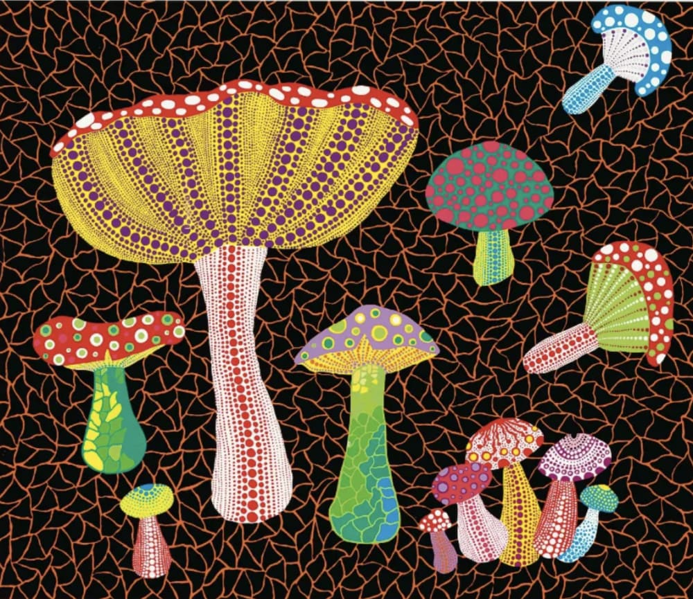
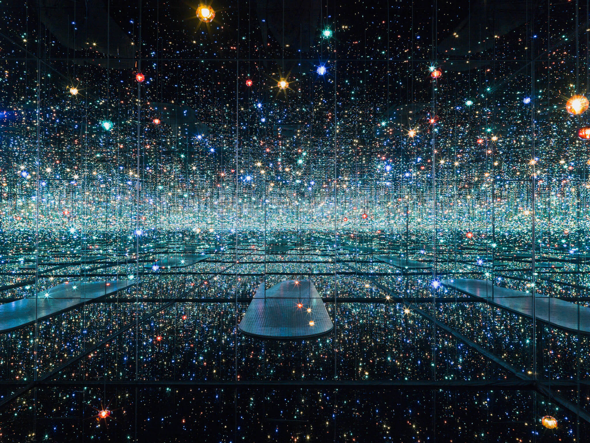
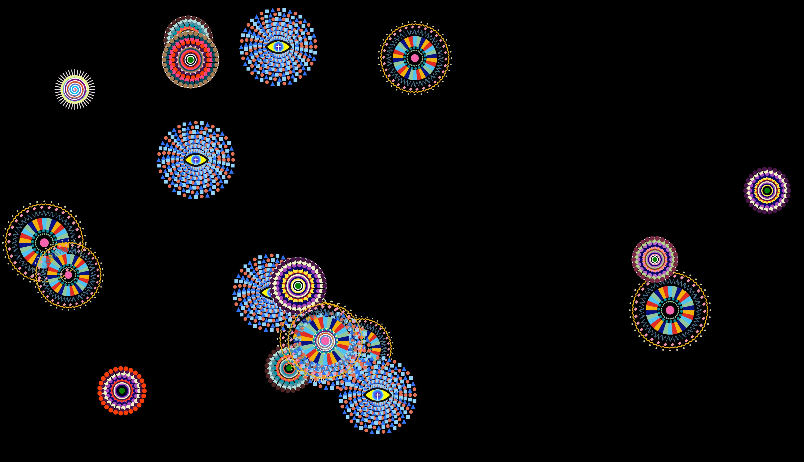

# jzha0690_9103_tut2_Major_Project_Individual

# Functioning prototype
## Instructions

Instructions on how to interact with the work:
- **Click and drag** the centre of the mushroom caps to anywhere on the canvas (create your own version of Yayoi Kusama's toadstools!). When you **release** the mouse, there will be a *pop* sound.
- Press the **g** or **G key** to toggle gravity. All the mushrooms will fall towards the bottom of the window, accompanied by a *thud* sound.
- If you try to **click and drag** a mushroom, the mushroom will fall back down due to gravity.
- Press the **g** or **G key** again to turn off gravity. You can freeze the mushrooms mid air or rearrange them however you would like.
- Press the **up arrow** for all the mushrooms to float towards the top of the screen. This is accompanied by a light and *glittery* sound effect.

## Individual approach

This section details my individual approach to animating the group code.

I chose user interaction to drive my individual code. I decided to support this approach with audio to elevate the interaction experience.

From the image that my team and I created, we decided on unique methods to animate the work. Through thorough discussion, we decided on the following:
- Jess (interaction): Allowing the user to move the mushrooms wherever they would like in the window, as well as making the mushrooms fall to the bottom and also float to the top of the window.
- Jen (audio): Changing the size and scale of the mushrooms and patterns, as well as the colour of the triangular background based on the frequency of the audio
- Viko (time): Background lines drawn along paths, and mushrooms bouncing vertically while swaying from side to side.
- Fangxia (perlin noise): Added animation on all mushroom patterns, and when someone clicks a mushroom, it starts pulsing - clicking it again will stop the animation.

### Inspiration and references

#### *Toadstools* by Yayoi Kusama, 1990
*Toadstools*, shown in Figure 1, is the artwork we chose to represent as a group, which formed the basis for my individual work. In choosing this artwork, I found many pieces created by Yayoi Kudsama throughout the years with similar motifs of repetitve patterns, biomorphic forms, and similar colour scales (simultaneously bright and muted). In animating this artwork, I wanted to allow the user to create their own version of *Toadstools* by moving the mushrooms. Further, Kusama often produces immersive artworks and experiences such as the *Infinity Mirrored Room* shown in Figure 2. My aim was to encapsulate the sense of immersion that Kusama's works create, and translate it through interactive elements and sound within my code.

Figure 1. *Toadstools*, Yayoi Kusama, 1990 [(Geist, 2024)](https://geistmc.com/our-artists/yayoi-kusama/prints-and-multiples/yayoi-kusama-toadstools-1990/)

 Figure 2. Infinity Mirrored Room - The Souls of Millions of Light Years Away, Yayoi Kusama [(Phaidon, 2022)](https://www.phaidon.com/en-anz/blogs/stories/anatomy-of-an-artwork-yayoi-kusama?srsltid=AfmBOoqG7ywfHHN86Jwtitxakb-LDptJZurKCb6_jJ83qlAMAfaXDnD6)

#### IDEA9103
Animated code through p5.js concepts introduced within IDEA9103:
- Week 6: Event listeners
- Week 8: Responsive design
- Week 9: Transformations
- Week 11: Sound

#### The Coding Train
- [Bezier Curves](https://youtu.be/enNfb6p3j_g?si=bTE6VKCEfOE7OgCm) for the background code to make the netting look more organic
- [Events and Inputs](https://youtu.be/HsDVz2_Qgow?si=A7cjPK5CTnLbP1dO) for user input animation
- [Mouse interaction with objects](https://youtu.be/TaN5At5RWH8?si=i6x2vJCf2P3PEIgp) for user input animation

#### Final assignment example - *Wheels of Fortune* (Group A - Cora)
Seeing the user interaction for this code inspired the ideation for incorporating user input into the design. Seeing the different user input features run effortlessly together inspired my approach.

 Figure 3. Final assignment example [(Canvas, 2025)](https://canvas.sydney.edu.au/courses/67353/modules)

#### Astronomy
I drew inspiration from recent documentaries viewed on astronomy and quantum physics (Figures 4 and 5) with the central concept of gravity, which I then integrated into my design.

Figure 4. *Decoding the universe*, DW Documentary [(Youtube, 2024)](https://youtu.be/QJKc4WsIkvw?si=Hf1BH6aRR6EVYe7j)

Figure 5. *Exploring infinite scales with Jim Al-Khalili* [(Youtube, 2025)](https://youtu.be/9g01PQAEIZY?si=Q2N0kzJv17g4gkp2)

#### Inspiration for background
- Steve's Makerspace - [Making simple patterns in p5.js](https://www.youtube.com/watch?v=ig0q6vfpD38) for idea generation and generative art inspiration
- YetiBlue - [Mosaic](https://editor.p5js.org/yetiblue/sketches/2LuMOM0bl) which formed the starting point of the background code

#### Copilot
Copilot was used to refine ideas and debug code.

## Technical explanation of individual code
- The `preload()` function is used to load in the sound effects
- The `setup()` function draws the artwork like Kusama’s *Toadstools* as the initial page
  -The large mushroom is an object literal that is created from the stem and the cap
  - Each small mushroom is an instance of custom classes
  - Each mushroom is a separate element over the background canvas
  - Changes to the group code were made here to isolate elements clearly for ease of animation, to add velocity for gravity animation, and to ensure all elements existed with the design space
- The `draw()` function draws the large mushroom and each small mushroom individually and stores them in separate arrays
    - If `gravityOn` is toggled, the mushrooms will fall towards the bottom of the window
    - If `floatOn` is toggled, the mushrooms will float towards the top of the window

- The `windowResized()` function was used to create responsive design
- Everything initially exists on the design canvas which is then scaled to be responsive with the window width and height

- Mouse dragging user input logic using if statements
  - A boundary is created over every mushroom 
  - When the user *click and drags* within the boundary over a mushroom, the mushroom can be relocated to anywhere in the window
  - When the mouse is *released*, there will be a *pop* sound

- User input logic for when specific keys are pressed using if statements
  - Toggling `gravityOn`: If `g` or `G` is pressed, all mushrooms will fall towards the bottom of the window and there will be a *thud* sound. If `g` or `G` is pressed again (i.e. turned off), all mushrooms will stay on the canvas. This can be frozen mid-fall or rearranged however the user would like to.
  - Toggling `floatOn`: If the `UP_ARROW` is pressed, all mushrooms will float towards the top of the window and there will be a *glittery* sound. 